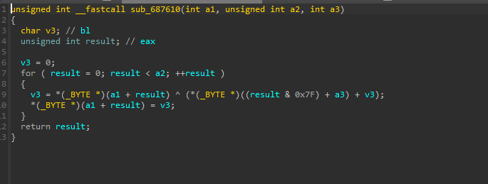
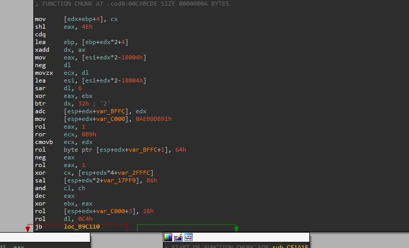

# Reverse Engineering MetaTrader 4: How the EX4 Protection System Works

**Author:** 0xMastEB
**Target:** MetaTrader 4 Terminal (build 1471), MetaEditor, EX4 binary format
**Platform:** Windows x86

---

## Tools

- IDA Pro - static analysis of terminal.exe and metaeditor.exe
- Frida (Windows x86) - dynamic instrumentation, Stalker tracing, function hooking
- Python 3 - scripting, cipher implementation, verification
- MetaEditor - MQL4 compilation, controlled test file generation

---

## Overview

MetaTrader 4 is one of the most used trading platforms out there. It runs plugins called Expert Advisors (EAs) - compiled MQL4 code packaged as `.ex4` binaries. These files are protected by multiple layers of crypto: RSA-1024 signatures, a custom stream cipher, MD5 integrity checks, and an obfuscated verification engine sitting inside a `.cod0` section that you can't decompile.

I spent 12 sessions reversing the full EX4 protection chain, combining IDA static analysis with targeted Frida instrumentation. Every formula and constant was verified across multiple files before I considered it confirmed.

---

## EX4 File Format

The EX4 binary has a fixed header followed by encrypted payload sections.

### Header Layout (0x000 - 0x3FF)

| Offset | Size   | Description                                                 |
|--------|--------|-------------------------------------------------------------|
| 0x000  | 3      | Magic bytes: `EX-`                                         |
| 0x004  | 4      | Version/build info                                          |
| 0x00A  | 1      | Protection flag                                             |
| 0x00B  | varies | Metadata (copyright, description, link - plaintext strings) |
| 0x300  | 16     | Initialization vector for file integrity hash               |
| 0x310  | 16     | MD5 file integrity hash                                     |
| 0x320  | 128    | RSA signature                                               |
| 0x3A0  | 16     | Encrypted section table                                     |
| 0x3B0  | 80     | Gap region (unencrypted)                                    |
| 0x400  | ...    | Encrypted payload (bytecode + strings)                      |

### Section Table

The 16-byte section table at `0x3A0` is XOR-encrypted with a key derived from the signature. Once decrypted it contains four little-endian DWORDs with the offsets and sizes of the bytecode and strings sections.

Important finding: the bytecode and strings sections are encrypted independently with separate keys and cipher states. This was not obvious at all and took a while to figure out.

### Payload

Two encrypted sections after the header:

1. **Bytecode section** - starts at `0x400`, compiled MQL4 VM opcodes, metadata tables, LZO-compressed data
2. **Strings section** - follows the bytecode, string literals and identifiers

Same cipher algorithm for both, but different key tables and independent initialization states.

---

## RSA-1024 Signature System

### Dual-N Architecture

This one confused me for a while. MT4 uses two completely separate RSA moduli:

- **N_xor** - used only for XOR-based key derivation
- **N_rsa** - used for actual RSA signature verification

I kept conflating these two early on and getting wrong results. They look similar but do completely different things in the protection chain. Once I separated them everything started making sense.

### Key Discovery

The public exponent `e = 17` is hardcoded in terminal.exe. The private key components were found by analyzing MetaEditor's CRT-optimized signing function. By hooking that function during compilation of a controlled test file, the CRT parameters were captured directly from the signing operation.

Verification: signing a known message with the extracted key produces signatures byte-identical to MetaEditor's output. Perfect match.

### RSA Message Structure

The 128-byte RSA message has a fixed internal layout: an MD5 integrity hash of the decrypted bytecode, a format validation marker, per-EA metadata fields, and a secondary integrity hash. If the RSA verification succeeds but the format marker is missing, the file gets rejected anyway.

---

## Stream Cipher

### How I Found It

This was the breakthrough of the entire research. The cipher function sits in MetaEditor's `.text` section as a normal decompilable function.



In terminal.exe the exact same logic is buried inside the obfuscated `.cod0` section where you can't read anything. But MetaEditor just exposes it in `.text`. Same algorithm, completely different accessibility.

I found it by hooking MetaEditor during compilation and tracing the data flow between plaintext bytecode and the RSA signing input. A Frida hook confirmed zero mutations between the cipher output and the signing input - so this is the complete cipher, nothing else happens to the data.

### Algorithm

```cpp
void cipher(uint8_t *buf, int size, uint8_t *table) {
    uint8_t fb = 0;
    for (int i = 0; i < size; i++) {
        fb = buf[i] ^ ((table[i & 0x7F] + fb) & 0xFF);
        buf[i] = fb;
    }
}
```

CFB-like stream cipher. 128-byte key table indexed cyclically, feedback register chains every byte into the next. Encryption and decryption use the same exact function - the only difference is which buffer provides the feedback byte.

### Separate Section Encryption

Bytecode and strings are encrypted independently with different key tables derived from different RSA components. Each section starts with a fresh cipher state. Confirmed by achieving 100% roundtrip decryption/re-encryption across multiple test files.

### The Mutation Problem

When comparing cipher output between MetaEditor and terminal.exe, about 0.3% of bytes differ. Groups of 4-8 bytes at semi-regular intervals that don't match.

Took me a while to understand what was going on. Turns out the integrity hash is computed from the pure cipher output without these mutations. Terminal verifies the hash first, then applies the mutations. So the mutations are a post-verification transformation and don't affect the crypto chain at all.

---

## Integrity Verification Chain

Terminal.exe runs a four-stage pipeline. Each stage has to pass before the next one runs.

### Stage 1: File Integrity Hash

MD5 hash at offset `0x310`. Covers the entire file with the hash field itself replaced by a cipher-derived component, concatenated with a hardcoded constant and the initialization vector from the header.

### Stage 2: RSA Signature Verification

Modular exponentiation with the public exponent. The result has to contain the format validation marker at a specific offset or the file gets rejected.

### Stage 3: Secondary Hash Check

12 bytes from the RSA message compared against an internally computed hash covering file metadata and structural information.

### Stage 4: Plaintext Integrity Check

After decryption, MD5 of the decrypted bytecode is computed and compared against the hash embedded in the RSA message. This is what makes naive modification impossible - change the encrypted bytecode and the decrypted result won't match the signed hash.

---

## The .cod0 Problem

All the verification logic in terminal.exe lives inside the `.cod0` section. Here's what it looks like when you try to analyze it:



Decompilation fails completely. IDA can't even do stack analysis. The instructions are a mix of nonsensical operations, rare opcodes like `xadd`, bit rotations with absurd constants, and jumps to scattered addresses. Reading this by hand is not realistic.

### How I Dealt With It

I didn't try to decompile it. Instead I used two approaches:

**Cross-references:** I found xrefs from `.cod0` into known `.text` functions (RSA modular exponentiation, MD5). 3 call sites for RSA and 54 for MD5. By disassembling the neighborhoods around each call and tracing data flow between them, I reconstructed the verification logic without understanding the obfuscated parts.

**Differential testing:** Start with a file that terminal accepts. Change one byte. Check if it still accepts. Repeat. After enough iterations I had a complete map of what gets validated and in what order, treating `.cod0` as a pure black box.

### Anti-Debug

The `.cod0` actively fights debugging:

- Frida Interceptor hooks on `.cod0` addresses crash the process
- INT3 breakpoints detected
- EB FE (infinite loop) patches detected
- VEH-based debugging blocked

What worked: Frida Stalker with a custom value-change tracker. Instead of logging every instruction (millions of events), I tracked only `xor`, `mov`, and `stosb` and reported only when values changed. Reduced the trace from millions of events to hundreds. This works because Stalker doesn't modify the code itself.

---

## MetaEditor as the Weak Link

Terminal.exe invests heavily in hiding everything inside `.cod0`. But MetaEditor exposes the exact same cryptographic functions in its `.text` section, fully decompilable.

The cipher, the MD5 implementation, the RSA signing - all sitting in `.text` where IDA reads them without any issues. I found the cipher by tracing the compilation pipeline:

1. MetaEditor compiles `.mq4` source to bytecode
2. Bytecode goes to the cipher function for encryption
3. Encrypted output goes directly to RSA CRT signing

Both MetaEditor and terminal.exe use standard MD5 with an obfuscation layer on the IV. The stored bytes are XOR'd with a constant - the result is the standard MD5 IV. Looks custom at first glance but it's just MD5 with extra steps.

---

## What I Learned

**Dual RSA modulus architecture** - two separate moduli for different purposes (XOR key derivation vs signature verification). Unusual design that caused a lot of confusion before I figured out they're independent.

**Architectural inconsistency** - terminal.exe protects the cipher inside `.cod0` but MetaEditor exposes the identical algorithm in `.text`. This was the key that opened everything. A protection system is only as strong as its weakest component.

**Independent section encryption** - bytecode and strings use the same cipher but with different keys and independent states. Not documented anywhere, required systematic testing to confirm.

**Post-verification mutations** - the `.cod0` mutates bytes after integrity verification, creating a discrepancy between MetaEditor and terminal output. Understanding this was post-verification, not part of the check, was critical.

**Differential testing works** - when you can't read the code, map its behavior through controlled inputs. Treated `.cod0` as a black box and mapped the entire verification pipeline without decompiling a single instruction of the obfuscated section.

---

## Conclusion

The EX4 protection system has solid layers: RSA-1024, custom stream cipher, multiple MD5 checks, obfuscated verification engine. Each layer works well on its own.

The problem is MetaEditor. Terminal.exe hides everything in `.cod0` but MetaEditor has the same crypto functions sitting in `.text` where anyone can decompile them. Analyzing the compiler instead of the runtime is what made the full reconstruction possible.

Every failed attempt during the 12 sessions taught me something about the verification chain. Systematic differential testing combined with targeted Frida instrumentation mapped the entire system without needing to crack the `.cod0` obfuscation.

A binary protection system has to maintain consistent security across all components that share cryptographic material. One exposed surface is enough.

---

*This research was conducted for educational and security research purposes only. No tools or materials enabling circumvention are distributed.*

*Questions or feedback? Reach me on [X](https://x.com/0xMastEB) or [LinkedIn](https://www.linkedin.com/in/filippo-licitra-02977038b/).*
